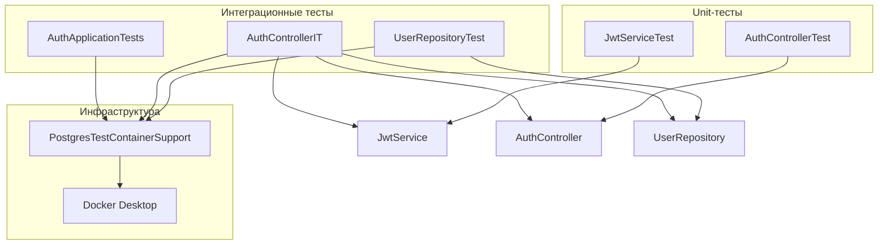

# Тестирование микросервиса `auth`

Документ описывает структуру, назначение и принцип работы тестов в модуле [`auth/`](../auth/).

---

## Обзор

В модуле **21 автоматический тест**, разделённый на три уровня:

| Уровень | Классы | БД | Spring-контекст | Скорость |
|---------|--------|----|-----------------|----------|
| **Unit** | `JwtServiceTest`, `AuthControllerTest` | Нет | Нет / slice | Быстро |
| **Integration (JPA)** | `UserRepositoryTest` | Testcontainers | `@DataJpaTest` | Средне |
| **Integration (E2E)** | `AuthControllerIT`, `AuthApplicationTests` | Testcontainers | `@SpringBootTest` | Медленнее |



---

## Запуск

### Все тесты модуля

```powershell
cd Z:\GitKraken\scada-editor-backend
.\gradlew :auth:test
```

### Отдельный класс

```powershell
.\gradlew :auth:test --tests "com.example.auth.controller.AuthControllerIT"
```

### Требования

1. **Java 17** (toolchain в `auth/build.gradle`)
2. **Docker Desktop запущен** — для интеграционных тестов с Testcontainers
3. Проверка: `docker ps` выполняется без ошибок

Первый прогон может занять 1–3 минуты (скачивание образа `postgres:16-alpine`).

### HTML-отчёт

После прогона: [`auth/build/reports/tests/test/index.html`](../auth/build/reports/tests/test/index.html)

---

## Инфраструктура тестов

### `PostgresTestContainerSupport`

**Файл:** [`auth/src/test/java/com/example/auth/support/PostgresTestContainerSupport.java`](../auth/src/test/java/com/example/auth/support/PostgresTestContainerSupport.java)

Базовый класс для всех тестов, которым нужна реальная PostgreSQL.

**Что делает:**

1. Перед тестами поднимает Docker-контейнер `postgres:16-alpine`
2. Создаёт БД `testdb` с пользователем `test` / паролем `test`
3. Через `@DynamicPropertySource` подставляет JDBC-настройки в Spring:
   - `spring.datasource.url` — динамический URL контейнера
   - `spring.datasource.username` / `password`
   - `spring.jpa.properties.hibernate.default_schema=auth`
   - `spring.jpa.properties.hibernate.hbm2ddl.create_namespaces=true`
4. После завершения тестов контейнер удаляется

**Почему Testcontainers, а не docker compose:**

- Каждый прогон получает **чистую изолированную БД**
- Dev-данные в `savushkin` не затрагиваются
- Тесты не зависят от «грязного» состояния после прошлых прогонов
- Не нужна ручная очистка таблиц перед `gradlew test`

Статический `@Container` в базовом классе означает **один контейнер на JVM** — все интеграционные классы в одном прогоне Gradle делят одну БД.

### Конфигурация Docker (Windows)

**Gradle** ([`auth/build.gradle`](../auth/build.gradle)):

```groovy
tasks.named('test') {
    environment 'DOCKER_HOST', 'npipe:////./pipe/dockerDesktopLinuxEngine'
    environment 'TESTCONTAINERS_RYUK_DISABLED', 'true'
}
```

**Testcontainers** ([`auth/src/test/resources/testcontainers.properties`](../auth/src/test/resources/testcontainers.properties)):

```properties
docker.host=npipe:////./pipe/dockerDesktopLinuxEngine
docker.client.strategy=org.testcontainers.dockerclient.EnvironmentAndSystemPropertyClientProviderStrategy
ryuk.disabled=true
```

### Моки Redis

`AuthControllerIT` и `AuthApplicationTests` мокируют:

- `RedisConnectionFactory`
- `ReactiveRedisConnectionFactory`

Redis для auth-тестов не нужен; моки позволяют поднять полный Spring-контекст без реального брокера.

---

## Unit-тесты

### `JwtServiceTest` (6 тестов)

**Файл:** [`auth/src/test/java/com/example/auth/JwtServiceTest.java`](../auth/src/test/java/com/example/auth/JwtServiceTest.java)

**Тип:** чистый JUnit 5, без Spring.

**Тестируемый класс:** [`JwtService`](../auth/src/main/java/com/example/auth/JwtService.java) — генерация и разбор JWT-токенов (HS256).

| Тест | Что проверяет |
|------|---------------|
| `generateToken_returnsThreePartJwtString` | Токен непустой и состоит из 3 частей (header.payload.signature) |
| `extractClaims_subjectEqualsLogin` | Claim `sub` = переданный login |
| `extractClaims_userIdClaimEqualsGivenId` | Custom claim `userId` = переданный ID |
| `extractClaims_tokenExpirationIsInFuture` | Срок действия токена в будущем |
| `extractClaims_invalidSignature_throwsJwtException` | Подмена подписи → `JwtException` |
| `extractClaims_randomGarbage_throwsJwtException` | Мусорная строка → `JwtException` |

**Как работает:** в `@BeforeEach` создаётся `new JwtService(secret, expirationMs)` напрямую, без `@Autowired`.

---

### `AuthControllerTest` (5 тестов)

**Файл:** [`auth/src/test/java/com/example/auth/controller/AuthControllerTest.java`](../auth/src/test/java/com/example/auth/controller/AuthControllerTest.java)

**Тип:** slice-тест `@WebMvcTest` + Mockito.

**Тестируемый класс:** [`AuthController`](../auth/src/main/java/com/example/auth/controller/AuthController.java) — REST `/api/auth/register` и `/api/auth/login`.

**Аннотации:**

- `@WebMvcTest(AuthController.class)` — поднимается только web-слой (контроллер + MockMvc)
- `@Import(SecurityConfig.class)` — подключается реальная конфигурация безопасности (CSRF отключён, `permitAll`)

**Замоканные зависимости:**

| Bean | Зачем |
|------|-------|
| `UserRepository` | Имитация БД |
| `PasswordEncoder` | Имитация BCrypt |
| `JwtService` | Имитация генерации токена |

**Сценарии:**

| Тест | HTTP | Вход | Ожидание |
|------|------|------|----------|
| `register_newUser_returns200WithToken` | POST `/api/auth/register` | Новый login | 200, JSON `{token, message}` |
| `register_existingLogin_returns400` | POST `/api/auth/register` | Существующий login | 400, `"User exists"` |
| `login_validCredentials_returns200WithToken` | POST `/api/auth/login` | Верный login + password | 200, JSON с token |
| `login_unknownLogin_returns401` | POST `/api/auth/login` | Несуществующий login | 401 |
| `login_wrongPassword_returns401` | POST `/api/auth/login` | Неверный password | 401 |

**Как работает:** `MockMvc` отправляет HTTP-запросы «внутри» JVM. Mockito задаёт поведение репозитория (`when(...).thenReturn(...)`). Реальная БД не используется.

---

## Интеграционные тесты

### `UserRepositoryTest` (3 теста)

**Файл:** [`auth/src/test/java/com/example/auth/repository/UserRepositoryTest.java`](../auth/src/test/java/com/example/auth/repository/UserRepositoryTest.java)

**Тип:** `@DataJpaTest` + Testcontainers.

**Тестируемый класс:** [`UserRepository`](../auth/src/main/java/com/example/auth/repository/UserRepository.java) — Spring Data JPA репозиторий для сущности `User`.

**Аннотации:**

- `@DataJpaTest` — поднимается только JPA-слой (EntityManager, репозитории)
- `@AutoConfigureTestDatabase(replace = NONE)` — не подменять datasource на H2, использовать Testcontainers PostgreSQL
- `extends PostgresTestContainerSupport` — изолированная БД

| Тест | Что проверяет |
|------|---------------|
| `findByLogin_existingUser_returnsOptionalWithUser` | `save` + `findByLogin` возвращает пользователя |
| `findByLogin_nonExistentUser_returnsEmptyOptional` | `findByLogin("nobody")` → `Optional.empty()` |
| `save_duplicateLogin_throwsDataIntegrityViolationException` | Два пользователя с одним login → исключение unique constraint |

**Как работает:** транзакции тестов по умолчанию **откатываются** после каждого метода — данные не «течут» между тестами внутри класса.

---

### `AuthControllerIT` (6 тестов)

**Файл:** [`auth/src/test/java/com/example/auth/controller/AuthControllerIT.java`](../auth/src/test/java/com/example/auth/controller/AuthControllerIT.java)

**Тип:** полный `@SpringBootTest` + `MockMvc` + Testcontainers.

**Что тестирует:** end-to-end цепочку HTTP → `AuthController` → `UserRepository` → PostgreSQL → `JwtService` → HTTP-ответ.

**Особенности:**

- `@TestMethodOrder(OrderAnnotation.class)` + `@Order(1..6)` — тесты выполняются **в заданном порядке**
- Тесты 1–5 используют одного пользователя `integrationUser` (данные накапливаются в рамках класса)
- Тест 6 использует отдельного пользователя `e2eUser`

| Order | Тест | Сценарий | Ожидание |
|-------|------|----------|----------|
| 1 | `register_newUser_returns200AndValidJwt` | Регистрация `integrationUser` | 200, валидный JWT (проверка через `extractClaims`) |
| 2 | `register_sameLoginAgain_returns400` | Повторная регистрация того же login | 400 `"User exists"` |
| 3 | `login_correctCredentials_returns200AndValidJwt` | Логин `integrationUser` / `pass123` | 200, валидный JWT |
| 4 | `login_wrongPassword_returns401` | Логин с неверным паролем | 401 |
| 5 | `login_unknownLogin_returns401` | Логин несуществующего пользователя | 401 |
| 6 | `registerThenLogin_endToEnd_returnsTokenBothTimes` | Register → login для `e2eUser` | 200 на обоих шагах |

**Как работает:**

1. Spring Boot поднимает **весь** микросервис (Tomcat, Security, JPA, контроллеры)
2. `MockMvc` шлёт HTTP-запросы на in-process сервер
3. Запросы проходят через реальный `AuthController`, данные пишутся в Testcontainers PostgreSQL
4. JWT проверяется реальным `JwtService`, а не моком

**Важно:** в отличие от `UserRepositoryTest`, здесь HTTP-запросы **коммитят** транзакции в БД. Порядок тестов и изолированная Testcontainers-БД критичны для корректной работы.

---

### `AuthApplicationTests` (1 тест)

**Файл:** [`auth/src/test/java/com/example/auth/AuthApplicationTests.java`](../auth/src/test/java/com/example/auth/AuthApplicationTests.java)

**Тип:** smoke-тест `@SpringBootTest`.

| Тест | Что проверяет |
|------|---------------|
| `contextLoads` | Spring-контекст приложения поднимается без ошибок |

**Как работает:** если не хватает бина, неверна конфигурация или не резолвится datasource — тест упадёт при старте контекста.

---

## Зависимости для тестов

Из [`auth/build.gradle`](../auth/build.gradle):

| Зависимость | Назначение |
|-------------|------------|
| `spring-boot-starter-test` | JUnit 5, AssertJ, MockMvc |
| `spring-security-test` | Тестирование Security |
| `mockito-core` | Моки для `@WebMvcTest` |
| `testcontainers:junit-jupiter` | `@Testcontainers`, `@Container` |
| `testcontainers:postgresql` | `PostgreSQLContainer` |
| `testcontainers-bom:1.21.3` | Версии Testcontainers |

---

## Частые проблемы

### `Could not find a valid Docker environment`

Docker Desktop не запущен или недоступен из Gradle.

**Решение:** запустить Docker Desktop, проверить `docker ps`, перезапустить тесты.

### Контейнер в статусе `Created`, тесты «висят»

Известная проблема Docker Desktop на Windows.

**Решение:** перезапустить Docker Desktop, отключить Resource Saver, повторить прогон.

### `400 User exists` в `AuthControllerIT`

БД не изолирована (тесты идут не через Testcontainers, а на общую `savushkin`).

**Решение:** убедиться, что класс наследует `PostgresTestContainerSupport` и Docker работает.

### `403 Forbidden` в `AuthControllerTest`

Не подключён `SecurityConfig` — CSRF блокирует POST-запросы.

**Решение:** `@Import(SecurityConfig.class)` на классе теста (уже есть).

### `NoSuchBeanDefinitionException: ReactiveRedisConnectionFactory`

Полный `@SpringBootTest` требует Redis-бины.

**Решение:** `@MockBean` для `RedisConnectionFactory` и `ReactiveRedisConnectionFactory` (уже есть).

---

## Связь с production-кодом

```
HTTP POST /api/auth/register
        │
        ▼
  AuthController.register()
        │
        ├── UserRepository.findByLogin()  ──► UserRepositoryTest
        ├── PasswordEncoder.encode()    ──► AuthControllerTest (mock)
        ├── UserRepository.save()
        └── JwtService.generateToken()  ──► JwtServiceTest
                │
                ▼
        TokenResponse { token, message }
```

Полный путь проверяется в `AuthControllerIT`.

---

## Рекомендации при добавлении новых тестов

1. **Логика без I/O** → unit-тест без Spring (`JwtServiceTest` как образец)
2. **HTTP + контроллер** → `@WebMvcTest` + моки (`AuthControllerTest`)
3. **JPA / репозиторий** → `@DataJpaTest` + `PostgresTestContainerSupport`
4. **Сквозной сценарий** → `@SpringBootTest` + `MockMvc` + `PostgresTestContainerSupport`
5. Не используйте фиксированные логины на общей dev-БД без изоляции
6. Для IT-тестов с общим состоянием — `@Order` или уникальные логины (UUID)
